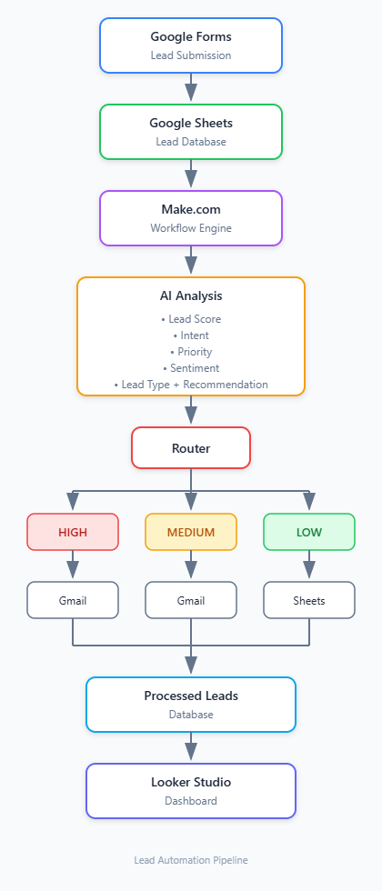

# AI-Powered Marketing & Lead Automation Platform

An end-to-end AI-powered marketing automation system that captures incoming leads, analyzes their intent and business value using AI, assigns priority, routes them through conditional workflows, and provides analytics through an automated dashboard.

---

## Overview

The **AI-Powered Marketing & Lead Automation Platform** automates the initial qualification and routing of marketing leads.

The system combines:

* Google Forms for lead collection
* Google Sheets for structured data storage
* Make.com for workflow orchestration
* AI for lead analysis and classification
* Gmail for automated notifications and follow-ups
* Looker Studio for analytics and reporting

The goal is to reduce manual lead qualification and ensure that higher-value opportunities receive faster attention.

---

## Problem

Marketing teams often receive leads containing unstructured information and varying levels of purchase intent.

Manually reviewing every submission can result in:

* Slow lead response times
* Inconsistent qualification
* Missed high-value opportunities
* Repetitive manual work
* Limited visibility into lead quality

A workflow is needed to automatically analyze incoming leads and determine the appropriate next action.

---

## Solution

This project implements an automated AI-driven workflow.

When a new lead is submitted:

1. The lead is captured.
2. The information is passed into Make.com.
3. AI analyzes the lead.
4. A lead score and classification are generated.
5. A router determines the appropriate workflow.
6. High-priority leads trigger immediate notifications.
7. Medium-priority leads trigger follow-up actions.
8. Low-priority leads are recorded for future analysis.
9. Processed data is stored for analytics.
10. Looker Studio visualizes the resulting data.

---

## Architecture

```text
Google Forms
     │
     ▼
Google Sheets
     │
     ▼
Make.com
     │
     ▼
AI Lead Analysis
     │
     ▼
   Router
  ┌──┼────┐
  │  │    │
  ▼  ▼    ▼
HIGH MED  LOW
  │  │    │
  ▼  ▼    ▼
Gmail Gmail Sheets
  │  │    │
  └──┼────┘
     ▼
Processed Leads
     │
     ▼
Looker Studio

---
## System Architecture



## System Screenshots

### Lead Capture & Dashboard


### Workflow / Analytics View


## Workflow

### 1. Lead Submission

A potential customer submits a marketing inquiry through the Google Form.

The form collects:

* Full name
* Email address
* Company name
* Company size
* Area of interest
* Business requirements

### 2. Lead Capture

The submission is stored in Google Sheets.

### 3. Automation Trigger

Make.com detects the new lead and starts the automation scenario.

### 4. AI Analysis

The lead information is analyzed using AI.

The AI generates structured classification data.

### 5. Conditional Routing

Make.com routes the lead according to its AI-generated priority.

### 6. Automated Actions

Different actions are executed depending on the lead classification.

### 7. Data Storage

The processed lead and AI classification are stored in the processed leads dataset.

### 8. Analytics

The processed dataset feeds the Looker Studio dashboard.

---

## AI Classification

The AI analyzes each lead across several dimensions.

| Field              | Description                             |
| ------------------ | --------------------------------------- |
| Lead Score         | Numerical score from 0–100              |
| Priority           | HIGH, MEDIUM, or LOW                    |
| Intent             | Primary purpose of the inquiry          |
| Lead Type          | Enterprise, SMB, Startup, or Individual |
| Sentiment          | Positive, Neutral, or Negative          |
| Recommended Action | Suggested next step                     |
| Reason             | Explanation for the classification      |

### Example AI Output

```json
{
  "lead_score": 87,
  "priority": "HIGH",
  "intent": "DEMO_REQUEST",
  "lead_type": "SMB",
  "sentiment": "POSITIVE",
  "recommended_action": "Contact sales immediately",
  "reason": "The lead has a clear business requirement and requested a product demonstration."
}
```

---

## Automation Logic

### High Priority

**Condition:**

```text
Priority = HIGH
```

**Action:**

* Send immediate email notification
* Record processed lead
* Flag lead for sales attention

---

### Medium Priority

**Condition:**

```text
Priority = MEDIUM
```

**Action:**

* Trigger follow-up workflow
* Record processed lead
* Add lead to the follow-up pipeline

---

### Low Priority

**Condition:**

```text
Priority = LOW
```

**Action:**

* Record lead
* Store AI classification
* Avoid unnecessary immediate notifications

---

### Fallback

Unexpected or unmatched classifications are routed to a fallback workflow for manual review.

This prevents unexpected AI output from silently terminating the workflow.

---

## Technologies

| Technology      | Purpose                                |
| --------------- | -------------------------------------- |
| Make.com        | Workflow automation and orchestration  |
| Google Forms    | Lead collection                        |
| Google Sheets   | Lead storage                           |
| AI              | Lead analysis and classification       |
| Gmail           | Automated notifications                |
| Looker Studio   | Analytics dashboard                    |
| Webhooks / APIs | Workflow integration                   |
| JSON            | Structured AI output and data exchange |

---


## Test Cases

The automation was tested using multiple lead scenarios.

| Test | Scenario                    | Expected Priority | Result |
| ---- | --------------------------- | ----------------: | ------ |
| 1    | Enterprise demo request     |              HIGH | Passed |
| 2    | Product information request |            MEDIUM | Passed |
| 3    | General browsing            |               LOW | Passed |
| 4    | Unexpected/incomplete data  |          FALLBACK | Passed |

Detailed test documentation is available in [`docs/test-cases.md`](docs/test-cases.md).

---

## Results

The completed workflow demonstrates automated:

* Lead capture
* Lead qualification
* AI-based classification
* Priority scoring
* Conditional routing
* Email notifications
* Data storage
* Analytics

The system reduces the need for manual initial lead review and provides a structured process for handling incoming marketing inquiries.

---

## Future Improvements

Potential future enhancements include:

* CRM integration
* Automated personalized email generation
* Slack or Microsoft Teams notifications
* AI-powered lead response generation
* Lead enrichment using external APIs
* Duplicate lead detection
* Automated follow-up sequences
* Human-in-the-loop approval workflows
* Advanced lead scoring using historical conversion data
* Community message classification
* Sentiment-based escalation
* Automated customer support routing
* AI agent-based tool selection

---

## Project Documentation

* [Workflow Documentation](docs/workflow.md)
* [Test Cases](docs/test-cases.md)

---

## Disclaimer

This project is a portfolio implementation designed to demonstrate AI-powered workflow automation, API integrations, conditional routing, and analytics.
